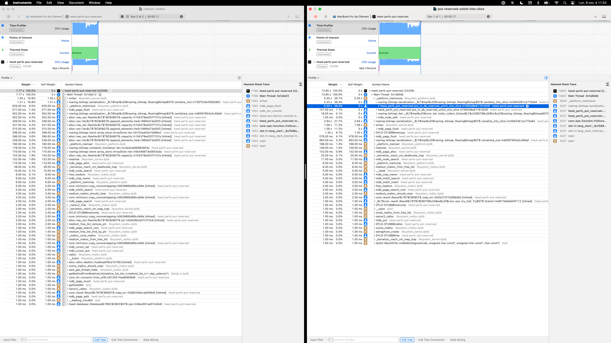

# heed-perfs-put-reserved
A small experiment with LMDB's MDB_RESERVE flag and Roaring Bitmaps

## What is this for?

While working on some Meilisearch optimizations, I considered reducing the number of `memcpy` calls when writing into our LMDB key-value store.

[LMDB can prepare a slice of bytes][1] and let you write into this uninitialized memory area afterward. What you have to do is give the key you want to insert and the size of the data that you need. It is helpful when you already know the size of it.

The Meilisearch indexation process does many `get`s and `put`s into LMDB databases. We mainly use RoaringBitmaps and serialize them into bytes. But as we use the default heed `Database::put` method, we must provide a slice of bytes to LMDB [via a codec][2]. Heed codecs return a `Vec`tor of bytes (under a `Cow`).

So, I was thinking about avoiding those possible multiple allocations of `Vec`s and `memcpy` calls from the source to the LMDB page and directly serializing the RoaringBitmap into the LMDB page allocation. I tried to do so in this code example, and I am astonished about the results: they are worse!

Can you help me understand why? I tried debugging the assembly, but I am not the best. It seems related to the available size assumptions that the code is no longer able to validate. I linked the flamegraphs in the _flamegraphs_ folder.

[1]: https://github.com/LMDB/lmdb/blob/c07884d1142f15bd3049bc9c2b62f1ef84992725/libraries/liblmdb/lmdb.h#L1359-L1366
[2]: https://github.com/Kerollmops/heed-perfs-put-reserved/blob/0fb495e60ed53d5dfd6fb8198eb6a562445a5ff9/src/roaring_bitmap_codec.rs
